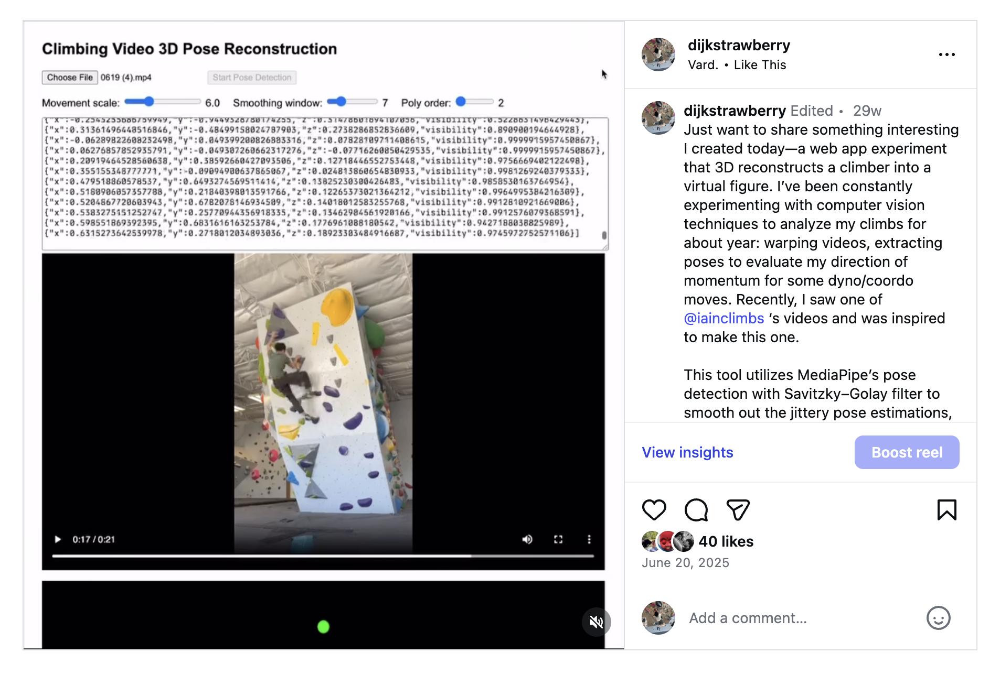

# Crux Web

A climbing pose 3D reconstruction web app that converts 2D video footage into interactive 3D skeletal animations.

> https://www.instagram.com/p/DLHRBuJuy9J/

## Details

- Next.js/TypeScript
- Three.js for interactive 3D visualization
- MediaPipe Pose for real-time human pose estimation

### Algorithm: Pose Smoothing with Savitzky-Golay Filter

The reconstruction pipeline applies temporal smoothing to stabilize pose estimates across video frames:

1. **Pose Detection**: MediaPipe Pose extracts 33 3D landmarks from video frames, capturing full-body skeletal structure
2. **Trajectory Extraction**: Hip position is tracked across frames to establish spatial reference and scale
3. **Savitzky-Golay Smoothing**: A polynomial smoothing filter with configurable window (default: 7 frames) and order (default: 2) reduces noise while preserving pose dynamics
4. **3D Visualization**: Smoothed landmarks are rendered in real-time as an interactive 3D skeleton with camera controls (orbit, pan, zoom)

### Key Features

- **Real-time Processing**: Video analysis and pose extraction on the client-side
- **Interactive Animation**: Playback controls with adjustable speed and frame-by-frame navigation
- **Configurable Smoothing**: Adjustable filter parameters via control panel for different activity types
- **Auto-scaling**: Automatic hip trajectory scaling for consistent pose representation across videos